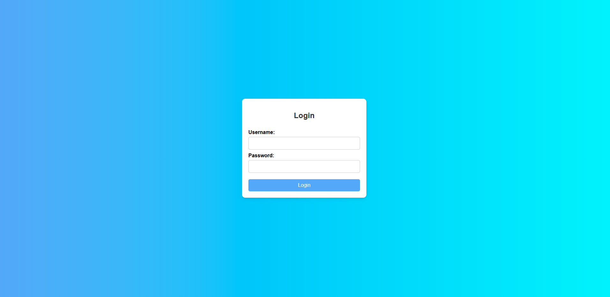
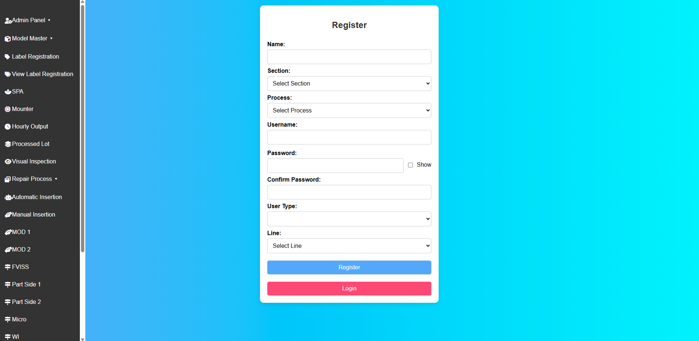
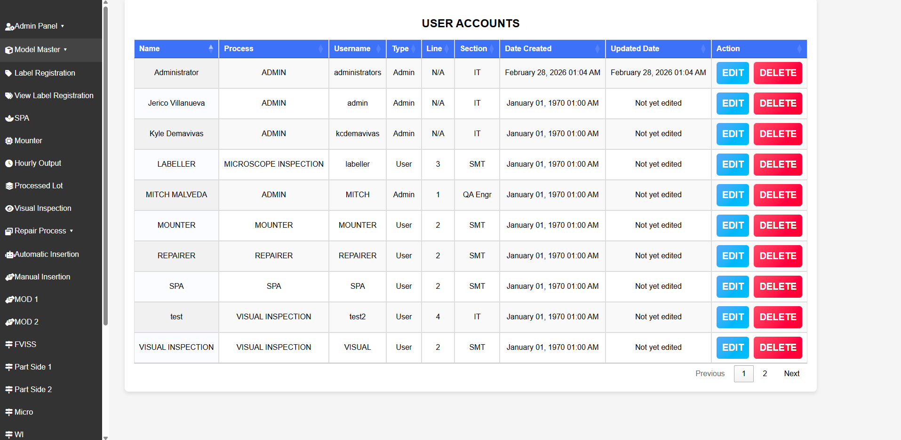
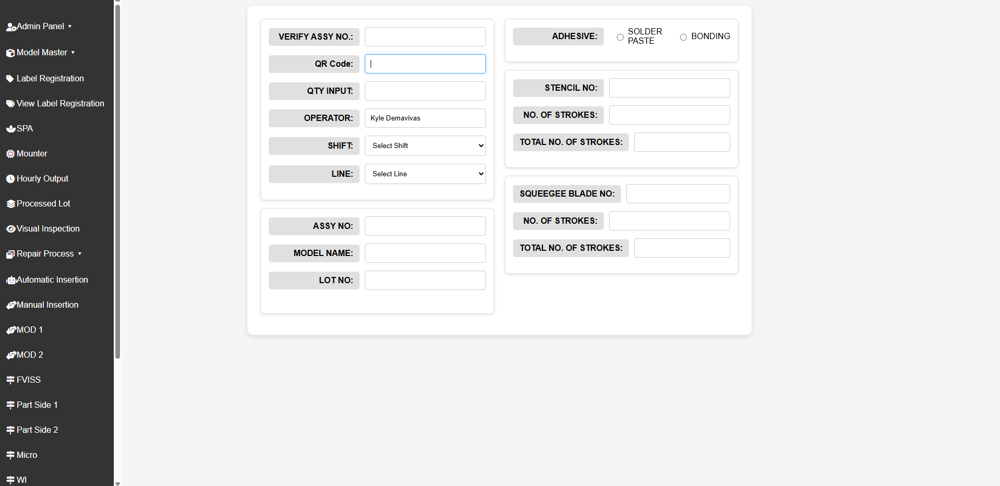
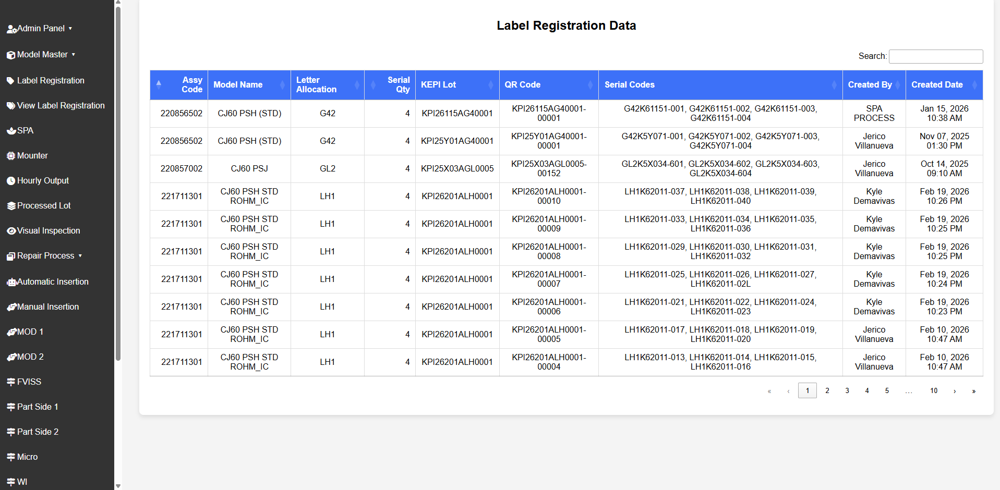
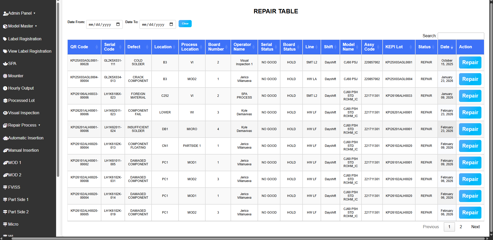

# Lot Traceability System

A web-based system designed to replace manual paper-based processes for monitoring and tracking lots through production. Significantly reduces lookup times and improves production monitoring efficiency.

>[!NOTE] 
>This system was inherited and extended as part of a solo developer role.
>Some features may not be fully implemented and is currently in testing.
>Refactoring and improvements were made during development.

## Requirements

- PHP 8.x
- Microsoft SQL Server or MySQL
- XAMPP or any local web server
- Web browser

## Installation

1. Clone the repository

   ```bash
   git clone https://github.com/KyleDemavivas/traceability.git
   ```

2. Move the project folder to your server's root directory (e.g. `htdocs` for XAMPP)
3. Import the database from the `/database` folder into your MySQL server
4. Configure your database connection in the config file
5. Start Apache and MySQL via XAMPP
6. Access the system at `http://localhost/traceability`

## Process Flow

1. User registration and login
2. Register new model if necessary
3. Register board details
4. SPA Process
5. Mounter Process
6. Visual Inspection
7. Automatic Insertion
8. Manual Insertion
9. MOD 1
10. MOD 2
11. FVISS
12. Partside 1
13. Partside 2
14. Micro
15. WI

## Repair Process Flow

Repair Process flow starts with the board being labeled as NO GOOD in any of the process other than SPA, Mounter, and Manual Insertion

1. Repair Table - Record the repair details, Input necessary information about the repair, submit to either normal verifify repair or Batchlot repair verify
2. Verify Repair - Verify the repair details, submit to process verification if GOOD or return to repair table if NO GOOD
3. Batchlot Repair Verify - Verify repair details, submit to process verification of GOOD or return to repair table if NO GOOD
4. Process Verification - Verify the repair details, Return to origin process if GOOD, return to repair table if NO GOOD

## Batchlot Process

The batchlot process is a separate process for boards which are labeled as NO GOOD between the normal FVISS and WI, once boards are labeled here as NO GOOD, they are considered as Batchlot Process Boards and will follow a new ruleset for repairs.

1. All batchlot boards are to return to FVISS Batchlot irregardless of what process they have a NO GOOD status
2. Process flow for batchlot boards are the same for the normal processes except the repair flow

## Features

- Lot tracking and monitoring through production
- Batch and label registration
- Lookup and search functionality with fast retrieval
- Reporting and batch lot reports
- Account settings management
- DataTables integration for efficient data display and pagination
- Centralized repair for all processes
- User Accounts management for ADMIN users only
- User Registration for new users found in ADMIN users dashboard

## Tech Stack

[](https://skillicons.dev)

- PHP
- jQuery
- MySQL
- Bootstrap
- HTML / CSS

## Libraries

- DataTables
- Select2
- FontAwesome
- SweetAlert2

## Problem Solved

This system digitized a manual paper-based lot tracking process used in production. Before this system, looking up lot information required searching through physical records. This system centralizes all lot data and dramatically reduces lookup times across all production processes.

## Screenshots













## Author

Kyle C. Demavivas || `demavivas.kyle.c@gmail.com` || `09959537531` || `www.linkedin.com/in/kyle-demavivas-968044331`
